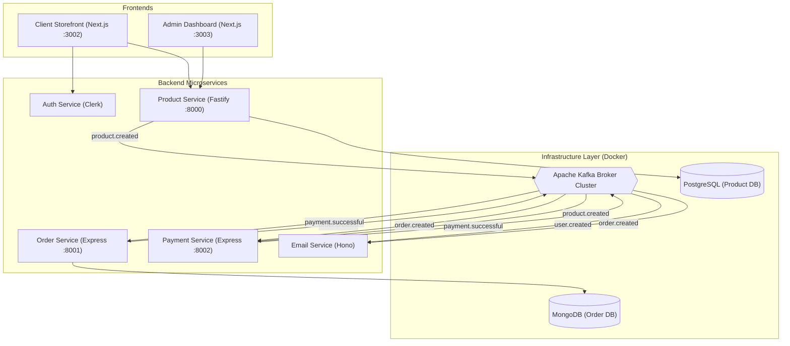

# System Architecture Diagram

This diagram illustrates the flow of data and events between the various microservices and the central Kafka message broker.

## How it works:
1. **Frontend Interaction**: Users interact with the **Client** storefront or **Admin** panel.
2. **Synchronous APIs**: Services like **Product Service** are called synchronously for data fetching from **PostgreSQL**.
3. **Asynchronous Events**: When an order is placed, the **Order Service** writes to **MongoDB** and emits an `order.created` event to **Kafka**.
4. **Event Consumers**:
    - **Payment Service** listens for `order.created` to process payments via Stripe.
    - **Email Service** listens for various events to send transactional notifications.
    - **Order Service** listens for `payment.successful` to update the order status.
